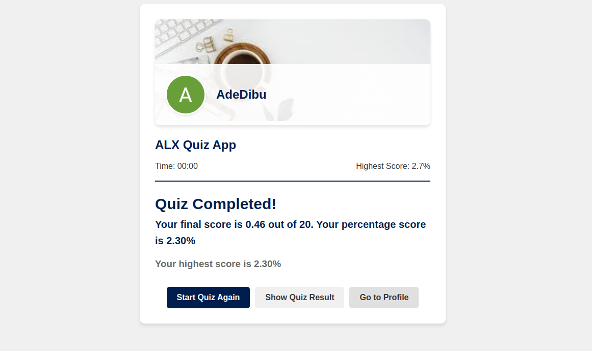
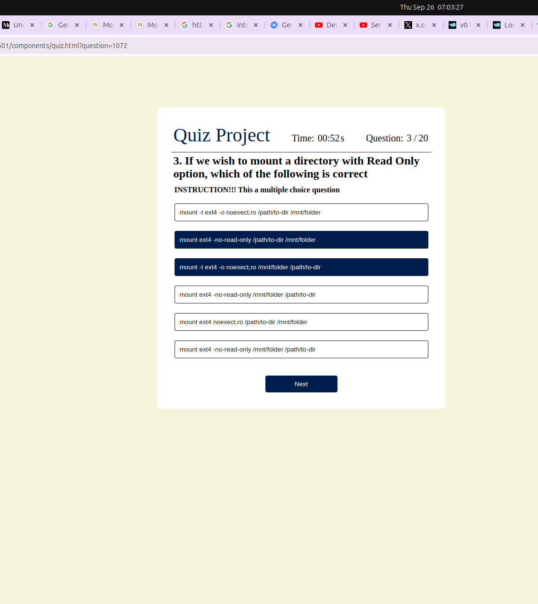
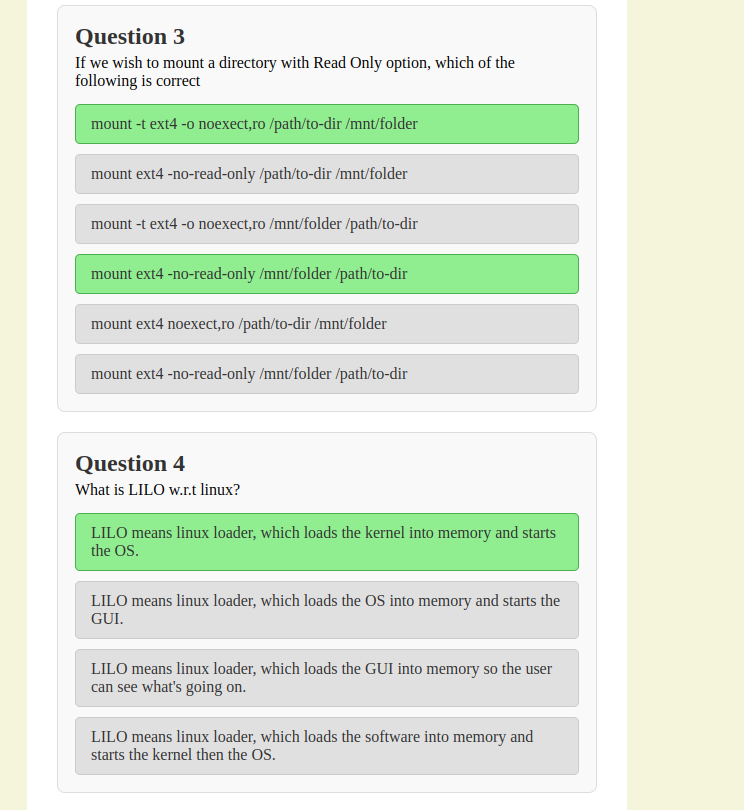

<h1 align="center">Quiz Web Application</h1>

<div align="center">

[]()
[](https://github.com/alibaba0010/authentication-and-authorisation-with-expressjs/issues)
[](https://github.com/kylelobo/The-Documentation-Compendium/pulls)
[](/LICENSE)

</div>

## 📝 Table of Contents

- [About](#about)
- [Getting Started](#getting_started)
- [Screenshots](#images)
- [Authors](#authors)
- [Acknowledgments](#acknowledgement)

## 🏁 About <a name = "about"></a>

This project aims to develop an engaging and interactive quiz application that provides users with a challenging and educational experience. The application will feature both single and multiple-choice questions across different subjects or topics, allowing users to test their knowledge and learn new information. To enhance the user experience, the application will incorporate scoring mechanics to track progress and provide incentives for continued participation. Additionally, time limits will be implemented to add an element of excitement and challenge, encouraging users to think quickly and strategically. To provide immediate feedback and enhance the learning process, the application will offer clear and informative responses to each question, highlighting correct answers and explaining incorrect choices.

## 🏁 Getting Started <a name = "getting_started"></a>

1. Ensure you have Node.js installed.
2. Create a free [Mongo Atlas](https://www.mongodb.com/atlas/database) database online or start a local MongoDB database.
3. Create a `server/.env` file with the properties specified in config.js file in services directory and add to the ".env" file.

```sh
In the terminal,
cd server

# Install dependencies
npm install

## Running the Project
In the terminal, run:

npm run start-server

install Live Server extensions in your code editor

 Open the index.html in "./frontend" folder using live server
```

## Screenshots <a name = "images"></a>





## ✍️ Authors <a name = "authors"></a>

- [@alibaba](https://github.com/alibaba0010) - Idea & Initial work

## 🎉 Acknowledgements <a name = "acknowledgement"></a>

- [Stackup](https://stackup.dev/)
